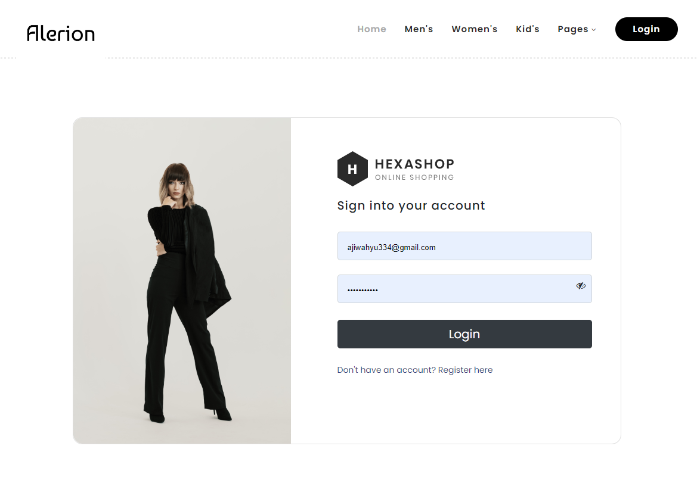
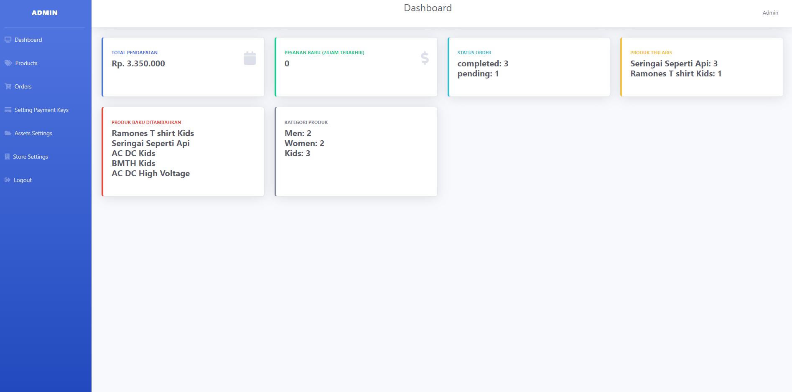
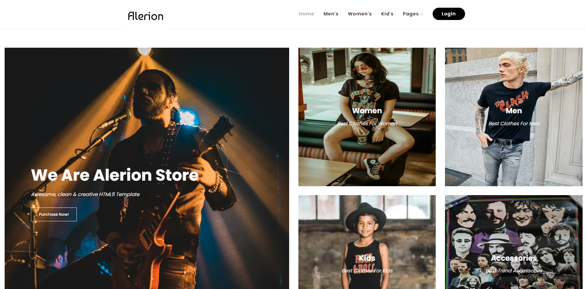
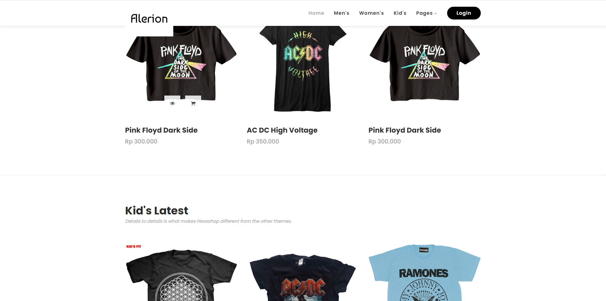
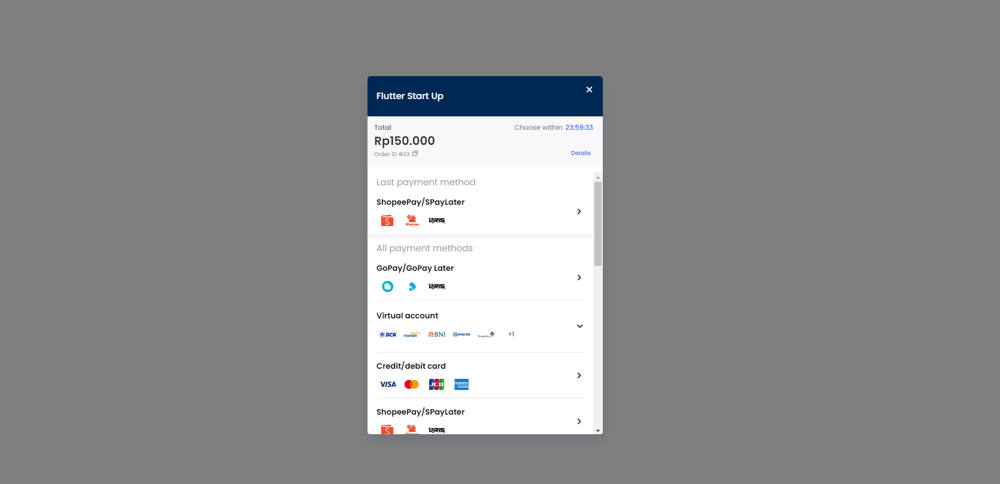

# My Awesome Project 🚀

Selamat datang di repositori proyek saya! Proyek ini adalah aplikasi web yang menampilkan beberapa fitur menarik. Berikut adalah beberapa tangkapan layar dari aplikasi kami:

## Tangkapan Layar 📸

### 1. Halaman Login 🔐

Ini adalah halaman login di mana pengguna dapat masuk ke dalam sistem.



---

### 2. Dashboard Admin 🛠️

Dashboard admin memberikan gambaran umum tentang berbagai aktivitas dan data dalam sistem.
Di sini, admin dapat mengelola produk, termasuk menambah, mengedit, atau menghapus produk.



---

### 3. Halaman Utama 🏠

Halaman utama yang menyambut pengguna setelah login, dengan berbagai informasi dan navigasi utama.



---

### 4. Produk 📦

Di sini, user dapat melihat produk, bisa melihat detail dan memasukkan ke keranjang.



---

### 5. Proses Pembayaran 💳

Halaman ini menunjukkan proses pembayaran yang sudah terintegrasi dengan midtrans.



---

## Fitur Utama ✨

- **Login yang Aman**: Autentikasi pengguna dengan tingkat keamanan tinggi.
- **Dashboard Admin**: Kelola seluruh sistem dari satu tempat.
- **Manajemen Produk**: Tambah, edit, dan hapus produk dengan mudah.
- **Proses Pembayaran**: Transaksi pembayaran yang cepat dan aman.

## Cara Menggunakan 📚

1. **Clone Repositori**:
   ```bash
   git clone https://github.com/username/my-awesome-project.git
